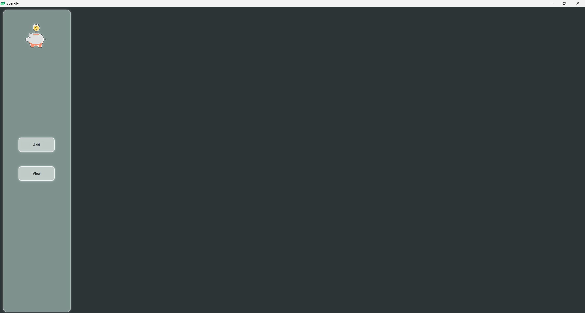
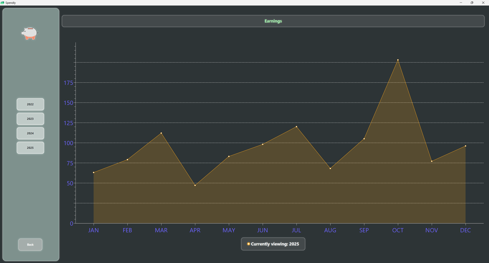

# Spendly - Finance Tracker

A lightweight personal finance tracker built with Java / JavaFX.

## Screenshots

**Screenshot 1**

**Screenshot 2**

## Features
- Track earnings and spendings
- Daily / Monthly / Yearly summaries
- Simple UI

## How to Run
1. Clone the repo
2. Run `Main.java`
3. Optional: load sample data from `sample_data/`

## License
MIT License © 2025 Jistal
